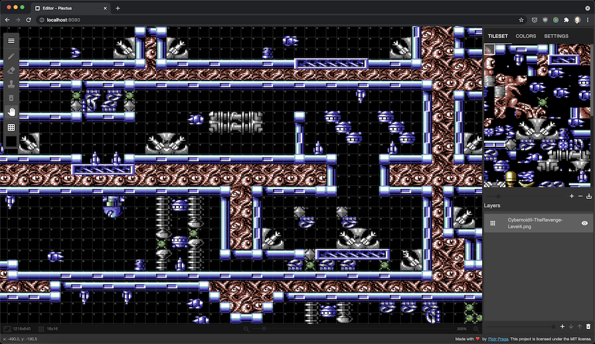

# Plextus

> Pixel art editor designed to make tiled maps and tilesets.

-   Plextus allows you to create and edit tile maps and tile sets, it also allows you to draw directly on tiles and track changes on your map in real time.
-   Plextus is fully compatible with [Tiled](https://www.mapeditor.org/) map editor and allows you to export your finished project to `.tmx` format.

# [Demo](http://plextus.surge.sh/)

## Installation

1. Clone/download repo
2. `yarn install` (or `npm install` for npm)

## Usage

**Development**

`yarn run start-dev`

-   Build app continuously (HMR enabled)
-   App served @ `http://localhost:8080`

**Production**

`yarn run start-prod`

-   Build app once (HMR disabled) to `/dist/`
-   App served @ `http://localhost:3000`

---

**All commands**

| Command               | Description                                                                   |
| --------------------- | ----------------------------------------------------------------------------- |
| `yarn run start-dev`  | Build app continuously (HMR enabled) and serve @ `http://localhost:8080`      |
| `yarn run start-prod` | Build app once (HMR disabled) to `/dist/` and serve @ `http://localhost:3000` |
| `yarn run build`      | Build app to `/dist/`                                                         |
| `yarn run test`       | Run tests                                                                     |
| `yarn run lint`       | Run linter                                                                    |
| `yarn run lint --fix` | Run linter and fix issues                                                     |
| `yarn run start`      | (alias of `yarn run start-dev`)                                               |

## See also

-   [Konva](https://konvajs.org/)
-   [Material-UI](https://material-ui.com/)
-   [Tiled](https://www.mapeditor.org/)
